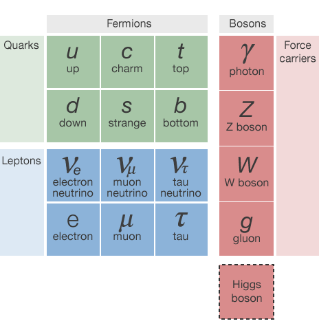
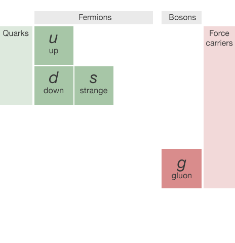
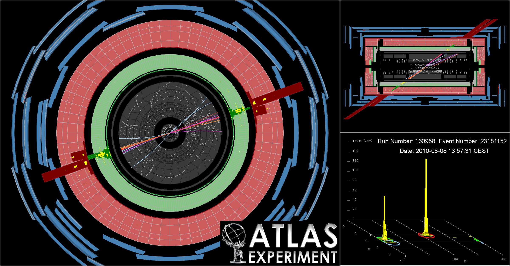

<style>
.reveal h1,
.reveal h2,
.reveal h3,
.reveal h4,
.reveal h5,
.reveal h6 {
  font-family: "Quicksand", sans-serif;
  letter-spacing: -0.08em;
  text-transform: uppercase;
  text-shadow: none; }
.reveal {
  text-align: left;
  font-family: "Open Sans", sans-serif;
}
.noborder .reveal section img {
  background:none; 
  border:none; 
  box-shadow:none;
  }
  .small-code pre code {
  font-size: 1em;
}
.midcenter {
    position: fixed;
    top: 50%;
    left: 50%;
}
.footer {
    color: grey; background: none;
    text-align:left; width:100%;
}
.left {
    text-align:left;
}
.right {
    text-align:right;
}
table.mytable {
  border: none;
  width: 100%;
  border-collapse: collapse;
  font-size: 45px;
  line-height: 50px;
  color: black;
}
</style>

## Machine learning for particle physics using R
<br>
#### Andrew John Lowe
<br>
#### Wigner Research Centre for Physics,
#### Hungarian Academy of Sciences

<script src="jquery.min.js"></script>

---
### Introduction: about this talk

* I'm a particle physicist, physicist programmer, and aspiring data scientist
  - Worked for 10 years on the development of core software and algorithms for a multi-stage cascade classifier that processes massive data in real-time$^*$
* I'm not a machine learning expert $-$ yet
* Nevertheless, switching to R has made it easier for me to ask more complex questions from my data than I would have been able to otherwise
* This is a walk-through of an ongoing analysis that I am performing entirely in R
* Computing power was limited to my own laptop

.footer <small><br>* [Big Fast Data in High-Energy Particle Physics](http://biconsulting.hu/letoltes/2015budapestdata/budapestdata2015_loweandrewjohn.pdf), A. J. Lowe, Budapest Data Forum, 3 June 2015</small>

---
### What is particle physics?

- The study of subatomic particles and the fundamental forces that act between them
- Present-day particle physics research represents man's most ambitious
and organised effort to answer the question: *What is the universe made
of?*
- We have an extremely successful model that was developed throughout the mid to late 20th century
- But many questions still remain unanswered
    * Doesn't explain: gravity, identity of dark matter, neutrino oscillations, matter/antimatter asymmetry of universe ...
- To probe these mysteries and more, we built the Large Hadron Collider

---
### The Large Hadron Collider (LHC)


---
### Example detector at the LHC


---
### The "Periodic Table" of particles



This talk focuses on the identification of *light* **quarks** (ignoring the heavy types) and **gluons**

---
### The "Periodic Table" of particles


This talk focuses on the identification of *light* **quarks** (ignoring the heavy types) and **gluons**

---
### What is a jet?

* For complex reasons (quantum chromodynamics!&nbsp;😱) that will not be described here, quarks and gluons are not observed individually
* Instead, we can only measure their decay products
* What we see is a cone-shaped spray of particles called a *jet*
* The measured particles are grouped together by a jet algorithm
  - Several different approaches and algorithms exist, but the most popular are **sequential recombination algorithms (hierarchical agglomerative clustering)**
  - Somewhat similar to the *k-means* algorithm

---
### Conceptual picture


Jets are viewed as a proxy to the initial quarks and gluons that we can't measure and are a common feature in high-energy particle collisions

---
### A jet seen by the CMS detector

```{r cmsjet1, fig.align='center', fig.height=8, fig.width=10, echo=FALSE, message = FALSE, warning = FALSE, error = FALSE}
require(png)
require(grid)
img <- readPNG("cmsjet1.png")
grid.raster(img)
```

Charged particle tracks and reconstructed jet cone

---
### A six-jet event seen by CMS

```{r cms-sixjets, fig.align='center', fig.height=8, fig.width=10.3, echo=FALSE, message = FALSE, warning = FALSE, error = FALSE}
require(png)
require(grid)
img <- readPNG("cms-sixjets.png")
grid.raster(img)
```

View along detector beam axis

---
### A two-jet event seen by ATLAS



View down beam axis, side view, and an "unrolled" detector visualisation showing two big energy peaks

---
### The problem in a nutshell

- Beams of energetic protons collide inside our detector
- Quarks and gluons emerge and decay into collimated sprays of particles
- Algorithms cluster these decay products into jets
- For each jet, we'd like to know what initiated it
- Was it a <font color="blue">**Quark?**</font> Or a <font color="red">**Gluon?**</font>
- Being able to accurately discriminate between quark- and gluon-initiated jets would be an extremely powerful tool in the search for new particles and new
physics
- This is an archetypal classification problem that might be amenable to machine learning

---
### Machine learning<br>& particle physics

* Machine learning is more or less what is commonly known in particle physics as multivariate analysis (MVA)
* Used for many years but faced widespread scepticism
* Use of multivariate pattern recognition algorithms was basically taboo in new particle searches until recently
* Much prejudice against using what were considered "black box" selection algorithms
* Neural nets and Fisher discriminants used somewhat in the 1990's
* Boosted Decision Trees (AdaBoost, invented in 1996) is the favourite algorithm used for many analyses (1st use: 2004)
<br>


.footer <small>[Successes, Challenges and Future Outlook of Multivariate Analysis In HEP](http://iopscience.iop.org/article/10.1088/1742-6596/608/1/012058/meta), Helge Voss, 2015 J. Phys.: Conf. Ser. 608 (2015) 012058; [Higgs Machine Learning Challenge visits CERN](http://indico.cern.ch/event/382895/), 19 May 2015, CERN; [Boosted Decision Trees as an Alternative to Artificial Neural Networks for Particle Identification](http://arxiv.org/abs/physics/0408124), Hai-Jun Yang *et al.*, Nucl.Instrum.Meth. A543 (2005) 577-584</small>

---


- For experimental particle physics, [ROOT](http:://root.cern.ch) is the ubiquitous data analysis tool, and has been for the last 20 years old
- Command language: CINT ("interpreted C++") or Python
    * Small data: work interactively or run macros
    * Big data: compile code with ROOT libraries, run on Grid
- Data format optimised for large data sets
- Complex algorithms are difficult to do interactively
- End up writing huge C++ programs
- Lots of tweaking, endless edit-compile-run loops
- Might not be the best choice for prototyping new methods
<br>


.footer <small>See *Highlights and Analysis of the Answers to the ROOT Users' Survey*, ["ROOT Turns 20" Users' Workshop](http://indico.cern.ch/event/349459/), 15-18 September 2015, Saas-Fee, Switzerland</small>

---
### On C++ and data analysis

- Is C++ a good choice for data analysis?
    * Spend days coding something that runs in minutes **or**
    * Write something in a couple of hours that will run during your lunch break?
    * Which will get you your answer faster? What strategy will help you define where you should be focusing your efforts and which paths lead to dead-ends?
- [Larry Wall](https://www.youtube.com/watch?v=LR8fQiskYII), creator of Perl (speaking about differences in the number of lines of code needed to accomplish the same task using different languages):

<br>
<q>You can eat a one-pound stake, or a 100 pounds of shoe leather, and you feel a greater sense of accomplishment after the shoe leather, but maybe there's some downsides...</q>

---
### Why did I choose R?

- Chief among those were the need for fast prototyping and high-level abstractions that let me concentrate on what I wanted to achieve, rather than on the mechanics and the highly-granular details of how I might do it
- Incredibly easy to express what I want to achieve
- Exponentially-growing number of add-on packages
- Latest machine learning algorithms are available
- About 2 million R users worldwide$^*$; technical questions are answered extremely quickly (if not already)
- Not as fast as C++, but my goal is to quickly test new ideas rather than implement a final model
- Beautiful plots
- Fun to work with ☺

.footer <br><small>* <http://www.inside-r.org/what-is-r></small>


--- &vertical
### Data production pipeline

* Use experiment's software to process Monte Carlo simulated data that contains lots of jets
  - Insert my own C++ code with handcrafted features
* Attach ground-truth class labels (quark/gluon) to each jet
    - There is significant *class noise* (mislabelled jets)
  - Studies by others indicate the labelling procedure assigns the correct class for 90-95% of jets
  - Different labelling schemes exist, but none are perfect because Monte Carlo simulation cannot perfectly simulate real data
* Write-out data and convert to CSV format for use in R

***
### Class labelling

- Jets labelled using the partons in the generator event record
- Parton with highest $p_{\mathsf{T}}$ within a ${\Delta}R$ equal to the radius parameter of the jet algorithm determines the jet label
    * This is identical to the scheme used by ATLAS$^*$
    * This labelling procedure is not unambiguous and is not strictly identical for different MC generators
    * Definitions are not theoretically robust, but studies (with MADGRAPH) have shown that for most generators, truth labelling is identical to matrix-element-based labelling for 90-95% of (isolated) jets
<br>
<br>
    
.footer <small>* *Light-quark and gluon jet discrimination in $pp$ collisions at $\sqrt{s}=\mathrm{7\,TeV}$ with the ATLAS detector*, Eur.Phys.J. C74 (2014) 3023; *Light-quark and Gluon Jets in ATLAS: Calorimeter Response, Jet Energy Scale Systematics, and Sample Characterization*, ATLAS-CONF-2011-053, Mar. 2011, also ATLAS-CONF-2012-138, Sept. 2012</small>

***    
### What about mislabelled jets?

- Can impose a requirement that the jets are isolated to restrict contamination from wide-angle QCD radiation (not done; reduces sample size considerably, doesn't affect tagging performance much)
- Could construct ~80-90% purified samples from trijet and $\gamma$+jet data:
      * Proximity to photon, $\eta_{j1}\eta_{j2} + {\Delta}R(\gamma,j) < 2$: quark
      * Third jet in 3-jet event, $|\eta_{j3}| - |\eta_{j1} - \eta_{j2}| < 0$: gluon
- Methods exist for dealing with mislabelled training data
    * Majority vote filtering and consensus filtering can significantly improve classification accuracy for noise levels up to 30%$^*$
<br>

.footer <small>* *Identifying Mislabeled Training Data*, C. E. Brodley and M. A. Friedl, Journal of Artificial Intelligence Research, Vol. 11, pages 131-167, 1999</small>

---
### Getting and cleaning data in R

* **data.table** is extremely useful here:
  - **fread** found to be at least twice as fast as other methods I tried for importing my data
  - Helps me clean and filter my data and is super-fast, especially when using keys:
  
```
setkey(DT, numTracks) # Set number of particle tracks in the jet to be the key
DT <- DT[!.(1)] # Remove all single-track jets
DT[, (bad.cols) := NULL] # Remove junk columns
```
  
* **digest** is also useful for removing duplicate columns by fast comparison of hashes:

```
duplicate.columns <- names(DT)[duplicated(lapply(DT, digest))]
DT[, (duplicate.columns) := NULL]
```

* **knitr** and R Markdown used everywhere to document process; broke workflow into chunks, one R Markdown file for each, saving intermediate results along the way


---
### More data munging

* To give me some extra space in RAM to work I used **SOAR** (stored object caches for R):

```
Sys.setenv(R_LOCAL_CACHE = "soar_cache")
Store(DT) # data.table now stored as RData file on disk and out of RAM
```

* **caret** also provides some useful data-munging; I could reduce the size of my data by more than 50% with a conservative cut on correlations between features:

```
highly.correlated <- findCorrelation(
  cor(DT[,-ncol(DT), with = FALSE], method = "pearson"),
  cutoff = 0.95, names = TRUE)
```

* Removing duplicate and highly correlated features was critical for enabling my data to fit in RAM
  - To preserve interpretability, I prefer to choose which features to retain instead of letting **caret** pick features that might have less explanatory value

---
### Visualising a correlation matrix

<center>

```{r corrplot, echo = FALSE, message = FALSE, warning = FALSE, error = FALSE, fig.height=5.5, fig.align='center',fig.cap="Correlation matrix viewed with corrplot", cache=TRUE}
require(SOAR)
Sys.setenv(R_LOCAL_CACHE="../../JetTagging/soar_cache/")
Attach()
M <- cor(DT[,-ncol(DT)])
require(corrplot)
corrplot(M, order="hclust",tl.pos="n",cl.pos="b")
```
<small>Package used: **corrplot**. Labels omitted for clarity.</small>
</center>


* This visualisation type commonly used in particle physics, albeit with smaller matrices ($<$ 20 features)
* "OK" for small matrices, but the information value of visualisation diminishes for larger matrices


---
### Visualising a correlation matrix as a dendrogram

```{r dendro, echo = FALSE, message = FALSE, warning = FALSE, error = FALSE, fig.align='center',fig.cap="Correlation matrix viewed as dendrogram with ape", cache=TRUE}
require(SOAR)
Sys.setenv(R_LOCAL_CACHE="../../JetTagging/soar_cache/")
Attach()

distance <- function(x) { (1 - abs(x)) }

dd <- as.dist(distance(M))
hc <- hclust(dd)

gg_color_hue <- function(n) {
  hues = seq(15, 375, length=n+1)
  hcl(h=hues, l=65, c=100)[1:n]
}

require(ape)
par(mar = c(2.5, 2.5, 2.5, 2.5))
hc.cut <- cutree(hc, h = distance(0.95))
require(RColorBrewer)
myPalette <- colorRampPalette(rev(brewer.pal(9, "Set1")), space="Lab")
#color = myPalette(max(hc.cut))
color = gg_color_hue(max(hc.cut))
plot(as.phylo(hc), tip.color=color,type = "fan", rotate = 0)
```
<small>Package used: **ape**.<br>Hierarchical clustering of features using correlation as a distance measure.</small>

--- &vertical
### Visualising a correlation matrix as a force-directed network

```{r qgraph, echo = FALSE, message = FALSE, warning = FALSE, error = FALSE, fig.align='center',fig.cap="Correlation matrix viewed as force-directed network graph with qgraph", cache=TRUE}
require(SOAR)
Sys.setenv(R_LOCAL_CACHE="../../JetTagging/soar_cache/")
Attach()

require(qgraph)

edge.label.bg <- T
cex <- 0.75
borders <- T
details <- F
edge.labels <- F
border.width <- 1
posCol <- "blue"
negCol <- "red"
vTrans <- 128

Q<-qgraph(M,layout="spring", vTrans=vTrans, legend=F, posCol=posCol, negCol=negCol, borders=borders, border.width=border.width,labels=TRUE,label.cex=cex,label.scale=F, edge.labels=edge.labels,edge.label.cex=cex,edge.label.bg=edge.label.bg,details=details)
#Q<-qgraph(M,layout="spring", vTrans=vTrans, legend=F, posCol=posCol, negCol=negCol, borders=borders, border.width=border.width,labels=names(df[,-ncol(df)]),label.cex=cex,label.scale=F, edge.labels=edge.labels,edge.label.cex=cex,edge.label.bg=edge.label.bg,details=details)
```
<small>Package used: **qgraph**.<br>Connection strength between features (nodes) is proportional to thair correlation.</small>

---
### Visualising a correlation matrix as a force-directed network

```{r qgraph-labels, echo = FALSE, message = FALSE, warning = FALSE, error = FALSE, fig.align='center',fig.cap="Correlation matrix viewed as force-directed network graph with qgraph", cache=TRUE}
require(SOAR)
Sys.setenv(R_LOCAL_CACHE="../../JetTagging/soar_cache/")
Attach()

require(qgraph)

edge.label.bg <- T
cex <- 0.75
borders <- T
details <- F
edge.labels <- T
border.width <- 1
posCol <- "blue"
negCol <- "red"
vTrans <- 128

#Q<-qgraph(M,layout="spring", vTrans=vTrans, legend=F, posCol=posCol, negCol=negCol, borders=borders, border.width=border.width,labels=TRUE,label.cex=cex,label.scale=F, edge.labels=edge.labels,edge.label.cex=cex,edge.label.bg=edge.label.bg,details=details)
Q<-qgraph(M,layout="spring", vTrans=vTrans, legend=F, posCol=posCol, negCol=negCol, borders=borders, border.width=border.width,labels=names(df[,-ncol(df)]),label.cex=cex,label.scale=F, edge.labels=edge.labels,edge.label.cex=cex,edge.label.bg=edge.label.bg,details=details)
```
<small>Package used: **qgraph**.<br>Connection strength between features (nodes) is proportional to thair correlation.<br>**Edges and nodes can be labelled, but visualisation a little muddled for large networks.**</small>

---
### Feature ranking & selection

- The question addressed by this work can be formally stated as follows: can we use quantitative characteristics of the jets to classify them as quark-jets or gluon-jets? 
- This invites the question: how should we find the variables that provide the best discrimination between quark-jets and gluon-jets?
- We can use domain knowledge to drill down to what are believed to be the best discriminants; observables that:
  * Can explain most of the variance in the data
  * Are minimally correlated with each other
  * Provide the best predictive power
- How to optimally search the feature space? (Manual inspection may be impractical for a large feature set)

--- &vertical
### Problems of too many features

- Correlated features can skew prediction
- Irrelevant features (not correlated to class variable) cause unnecessary blowup of the model space
- Irrelevant features can drown the information provided by informative features in noise
- Irrelevant features in a model reduce its explanatory value (also when predictive accuracy is not reduced)
- Training may be slower and more computationally expensive
- Increased risk of overfitting

***
### Redundant & irrelevant features

.left What should we do when it is likely that the data contains many redundant or irrelevant features?

- **Redundant features** are those which provide no more information than the currently selected features
- **Irrelevant features** provide no useful information in any context

--- &vertical
### Feature ranking & selection methods

.left Several methods in R for feature ranking and selection:

- Iteratively remove features shown by a statistical test to be less relevant than random probes: the *Boruta* algorithm$^*$
- Rank by *information gain* (Kullback–Leibler divergence)$^\dagger$
- *Correlation Feature Selection* (CFS)$^\dagger$
- *Recursive Feature Elimination* (RFE, Backwards Selection)$^\ddagger$
- *Simulated annealing*$^\ddagger$
- *Genetic algorithms*$^\ddagger$
- *LogitBoost*$^\Diamond$
<br>
<br>

**Tried all of these with varying levels of success**

.footer <small>* **Boruta**, $\dagger$ **FSelector**, $\ddagger$ **caret**, $\Diamond$ **caTools**</small>

***
### Boruta

<small>
The basic principle, in a nutshell:

- Boruta algorithm is a wrapper built around the *random forest* classification algorithm 
    * Random forests are an ensemble learning method for classification (and regression) that operate by stochastically growing a forest of decision trees; each tree is grown in such a way that at each split only a random subset of all features is considered
- The importance measure of an attribute is obtained as the loss of classification accuracy caused by the random permutation of feature values between objects
- It is computed separately for all trees in the forest which use a given feature for classification
- Then the average and standard deviation of the accuracy loss are computed
- Claims to be robust against "selection bias"$^*$


</small>

.footer <small>* *Selection bias in gene extraction on the basis of microarray gene-expression data*, Christophe Ambroise and Geoffrey J. McLachlan, PNAS vol. 99, No. 10 (2002)</small>

***
### Information gain

<small>
- Information gain is based on the concept of entropy from information theory and is commonly used to decide which features to use when growing a decision tree<br><br>
 
$$
Entropy = - \sum_{i}{p_i}{\log_{2}}{p_i}
$$

- In machine learning, this concept can be used to define a preferred sequence of attributes to investigate to most rapidly classify an item
- Such a sequence is called a decision tree
- At each level, the feature with the highest information gain is chosen
- An alternative measure of "node impurity" commonly used in decision tree learning is the Gini impurity:<br><br>

$$1 - \sum_{i}{p_i}^2$$


</small>

***
### Recursive Feature Elimination

<small>

- First, the algorithm fits the model to all predictors
    * I used a _random forest_ for the model
- Each predictor is ranked using its importance to the model
- Let $S$ be a sequence of ordered numbers which are candidate values for the number of predictors to retain ($S_1$ $>$ $S_2$, $\dots$)
- At each iteration of feature selection, the $S_i$ top ranked predictors are retained, the model is refit and performance is assessed
- The value of $S_i$ with the best performance is determined and the top $S_i$ predictors are used to fit the final model
- To minimise the possibility of selection bias, I performed k-fold cross-validation during training with ten folds


</small>

***
### Correlation Feature Selection

<small>
- The Correlation Feature Selection (CFS) measure evaluates subsets of features on the basis of the following hypothesis: *"Good feature subsets contain features highly correlated with the classification, yet uncorrelated to each other"*

- The following equation gives the merit of a feature subset $S$ consisting of $k$ features:<br><br>

$$
Merit_{S_{k}} = \frac{k\overline{r_{cf}}}{\sqrt{k+k(k-1)\overline{r_{ff}}}}
$$

- where $\overline{r_{cf}}$ is the average value of all feature-classification correlations, and $\overline{r_{ff}}$ is the average value of all feature-feature correlations. These variables are referred to as correlations, but are not necessarily Pearson's correlation coefficient or Spearman's $\rho$.


</small>

---
### Feature selection results

* CFS and LogitBoost$^*$ are fast and deliver sensible results
  - Other methods are very slow for large data like mine; this limits their utility somewhat
* CFS and LogitBoost select both known features and features that are completely new
  - Known features: have already been proposed for quark/gluon jet tagging; this is a vital sanity check and indicates that the method works as intended
  - New features might provide insight on the underlying physics of the quark/gluon decay process process
* **Data-driven feature selection can be an effective means of searching the feature space for new discriminant variables**
  - We don't currently do this in particle physics

.footer <small>* Thanks to András Benczúr for suggesting LogitBoost for feature selection</small>


---
### Features found by CFS

```{r best-features, echo = FALSE, message = FALSE, warning = FALSE, error = FALSE,fig.width=12,fig.height=7.5, fig.align='center',fig.cap="Selection of best features", cache=TRUE}
require(SOAR)
Sys.setenv(R_LOCAL_CACHE="../../JetTagging/soar_cache/")
Attach()

require(ggplot2)
print(best_vars_ggplot)
```
<small>Packages used: **FSelector**, **reshape2**, **ggplot2**.<br>Selection of best features found by Correlation Feature Selection (CFS)</small>

---
### Prototype jet classifier

* I decided to use a boosted decision tree as my classifier
* Specifically, I used *Stochastic Gradient Boosting* or Gradient Boosting Machine (GBM)$^\dagger$ in **xgboost**
* There are several justifications for this choice:
  - Speed: whereas R is single-threaded, XGBoost runs using multiple threads and is very fast$^*$
  - Outstanding performance in Kaggle competitions
  - Can do *early stopping*: quit training if performance continues to degrade after N rounds; great for tuning$^*$
  - Can be tweaked to do Random Forests also$^*$
  - Robust with respect to *class noise* (this hurts AdaBoost)
<br>

.footer <small>$\dagger$ *Greedy Function Approximation: A Gradient Boosting Machine*, Jerome Friedman, The Annals of Statistics, Vol. 29, No. 5, Oct., 2001; *Additive logistic regression: a statistical view of boosting*, Jerome Friedman, Trevor Hastie, Robert Tibshirani, The Annals of Statistics, 2000, Vol. 28, No. 2, 337-407</small>

.footer <small>* I'm indebted to Szilárd Pafka for this info. He's done great work [benchmarking these tools](https://github.com/szilard/benchm-ml).</small>

<br>

---
### Results

```
Confusion Matrix and Statistics

          Reference
Prediction Gluon Quark
     Gluon 44991  8224
     Quark 34660 12125
                                          
               Accuracy : 0.5712          
                 95% CI : (0.5681, 0.5742)
```

```{r results, echo = FALSE, message = FALSE, warning = FALSE, error = FALSE,cache=TRUE}
require(SOAR)
Sys.setenv(R_LOCAL_CACHE="../../JetTagging/soar_cache/")
Attach()
#print((matrix_test$table))
#print((matrix_test$overall))
C11<-matrix_test$table[1,1]
C12<-matrix_test$table[1,2]
C21<-matrix_test$table[2,1]
C22<-matrix_test$table[2,2]
```


* We correctly tagged `r round(100*(C22/(C12+C22)))`% of true quark jets
* We mis-tagged `r round(100*(C21/(C11+C21)))`% of true gluon jets
* To put this in context, 60-70% efficiency is a typical working point for "*b*-jet tagging" and is considered acceptable$^*$
* However, mis-tag rates are typically much lower; usually about 0.5-2.5%$^*$ $-$ need to do a lot more work here ☹
<br>
<br>


.footer <small>* [Calibration of the performance of b-tagging for c and light-flavour jets in the 2012 ATLAS data](http://cds.cern.ch/record/1741020/files/ATLAS-CONF-2014-046.pdf), ATLAS Collaboration, ATLAS-CONF-2014-046, 6 July 2014</small>

---
### Future work

- I have unbalanced classes: gluon-jets are $>$80% of my data
  * I got bad results until I realised that most of the classifiers I tried were optimising for accuracy; results improved when I optimised for AUC instead
- Down-sampling the majority class could hurt performance, as we remove points that could be useful for defining the optimal decision boundary
- Bagging should help ameliorate this
- I plan to CV bag$^*$ to build an ensemble learner and try simultaneously down-sampling the folds used for training
  * Hope this will reduce training time and increase performance
- Add Random Forests and Deep Learning into the mix?
<br>

.footer <small>* [*Dissecting the Winning Solution of the HiggsML Challenge*](http://jmlr.org/proceedings/papers/v42/), Gábor Melis, Journal of Machine Learning Research, Workshops and Proceedings Vol 42, pp. 57–67, 2015</small>

---
### Summary

- It's often said that 80% of data analysis is spent on data munging$^*$ $-$ this was certainly true in my case
- However, I've found a good set of tools for streamlining this process; I've shared what I found most useful here
- I've shown how it is possible to use R for fast prototyping of a new method for binary classification
  * To the best of my knowledge, nobody has tried to do a particle physics analysis like this in R before
  * Will be invaluable for helping me decide where to direct my efforts later when building a final model
- I didn't have to spend time writing a ton of code or worrying about dangling pointers, *etc.*
- **R lets me focus on achieving the goals of my analysis**
<br>

<br>

.footer <small>* *Exploratory Data Mining and Data Cleaning*, Dasu T, Johnson T (2003), John Wiley & Sons</small>

---
### Data Science at CERN

* ["Data science @ LHC2015 Workshop"](https://indico.cern.ch/event/395374/), 9-13 Nov, CERN
  - Workshop to help foster connections between the data science and particle physics communities
  - Registration to attend is already maxed-out; but you can still join and participate via [video conference](https://indico.cern.ch/event/395374/videoconference/)
* A mailing list HEP-data-science@googlegroups.com has been created to deal with anything concerning both particle physics and data science, in particular machine learning
  - Announcement/discussion about workshops, challenges, papers, tools, *etc.*
  - Open to all, subscription by sending a mail to HEP-data-science+subscribe@googlegroups.com

---

## Thanks!

<br>

<small>[https://www.linkedin.com/in/andrewjohnlowe](https://www.linkedin.com/in/andrewjohnlowe)</small>

---
#### Join us!


