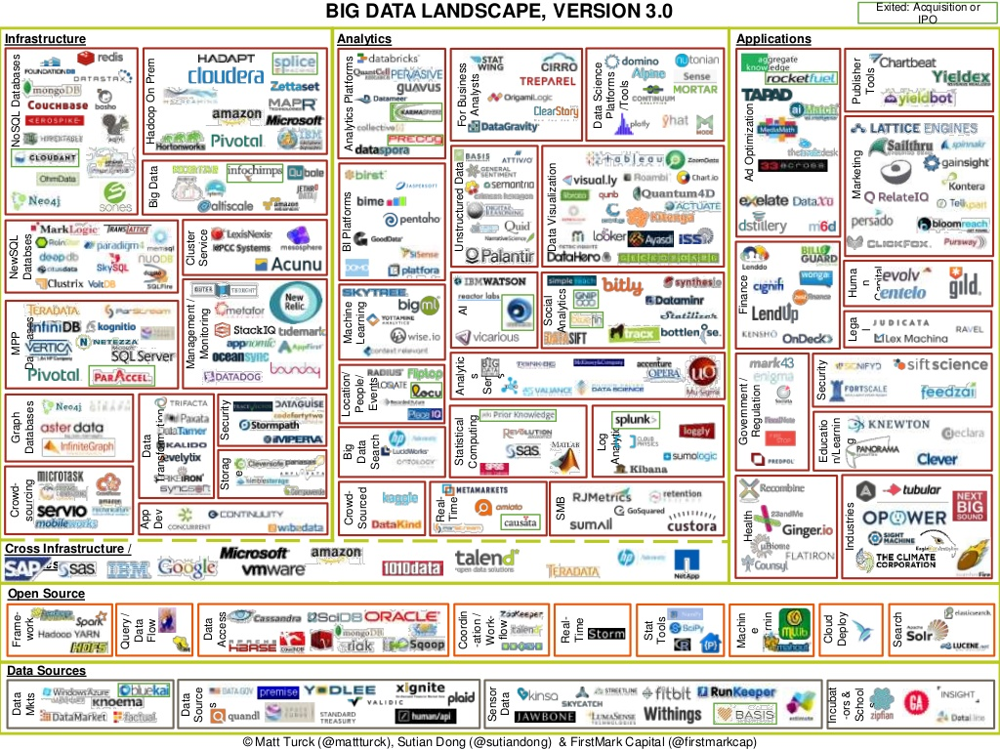

<style>
.reveal h1,
.reveal h2,
.reveal h3,
.reveal h4,
.reveal h5,
.reveal h6 {
font-family: "Quicksand", sans-serif;
letter-spacing: -0.08em;
text-transform: uppercase;
text-shadow: none; }
.reveal {
text-align: left;
font-family: "Open Sans", sans-serif;
}
.noborder .reveal section img {
background:none; 
border:none; 
box-shadow:none;
}
.small-code pre code {
font-size: 1em;
}
.midcenter {
position: fixed;
top: 50%;
left: 50%;
}
.footer {
color: grey; background: none;
text-align:left; width:100%;
}
.left {
text-align:left;
}
.right {
text-align:right;
}
table.mytable {
border: none;
width: 100%;
border-collapse: collapse;
font-size: 45px;
line-height: 50px;
color: black;
}
.blink {
animation: blink 1s steps(5, start) infinite;
-webkit-animation: blink 1s steps(5, start) infinite;
}
@keyframes blink {
to {
visibility: hidden;
}
}
@-webkit-keyframes blink {
to {
visibility: hidden;
}
}
</style>

## Machine learning for particle physics using R
<br>
#### Andrew John Lowe
<br>
#### Wigner Research Centre for Physics,
#### Hungarian Academy of Sciences

<script src="jquery.min.js"></script>

---
### Introduction: about this talk

* I'm shamelessly recycling slides that I presented at a data science conference in Budapest two weeks ago, so what follows will contain little (if any) physics
* As this is the inaugaral meeting of the LHC machine learning WG, let's start with the absolute basics: **tools**
* I'll talk about how using **R** has made it easier for me to ask more complex questions from my data than I would have been able to otherwise
* I'm not advocating that everyone should switch to R
* Hopefully this talk will be complementary to discussions of ROOTR and RMVA


---
### Tools

* Recognise that when you chose a specific analysis tool or framework, you are making a choice that invariably involves some kind of trade-off
  - Not always obvious what this compromise is
  - Do you have the right tool for the job?
* *When your only tool is a hammer, everything looks like a nail*
  - Generally a good idea to have some familiarity with more than one data analysis tool
* What analysis tools should our students learn?
  - Given that PhD $\neq$ academic career, what knowledge of tools would provide a good RoI and best equip students with the technical skills they need in a job outside HEP?
* What is available to particle physicists?
  

--- &vertical


- For experimental particle physics, [ROOT](http:://root.cern.ch) is the ubiquitous data analysis tool, and has been for the last 20 years old
- Command language: CINT ("interpreted C++") or Python
    * Small data: work interactively or run macros
    * Big data: compile with ROOT libraries, run on Grid
- Data format optimised for large data sets
- Complex algorithms are difficult to do interactively
- End up writing huge C++ programs
- Lots of tweaking, endless edit-compile-run loops
- The best choice for prototyping new methods?
<br>


.footer <small>See *Highlights and Analysis of the Answers to the ROOT Users' Survey*, ["ROOT Turns 20" Users' Workshop](http://indico.cern.ch/event/349459/), 15-18 September 2015, Saas-Fee, Switzerland</small>

---
## What happened outside HEP in the past 20 years?

---


---
### On C++ and data analysis

- Is C++ a good choice for data analysis?
    * Spend days coding something that runs in minutes **or**
    * Write something in a couple of hours that will run during your lunch break?
    * Which will get you your answer faster? What strategy will help you define where you should be focusing your efforts and which paths lead to dead-ends?
- [Larry Wall](https://www.youtube.com/watch?v=LR8fQiskYII), creator of Perl (speaking about differences in the number of lines of code needed to accomplish the same task using different languages):

<br>
<q>You can eat a one-pound stake, or a 100 pounds of shoe leather, and you feel a greater sense of accomplishment after the shoe leather, but maybe there's some downsides...</q>

---
### What I want in my tool box:


---
### Sometimes I want to use:


---
### Or sometimes:


---
### What ROOT provides

There are positives and negatives here...

---
### Why did I choose R?

- Chief among those were the need for fast prototyping and high-level abstractions that let me concentrate on what I wanted to achieve, rather than on the mechanics and the highly-granular details of how I might do it
- Incredibly easy to express what I want to achieve
- Exponentially-growing number of add-on packages
- Latest machine learning algorithms are available
- About 2 million R users worldwide$^*$; technical questions are answered extremely quickly (if not already)
- Not as fast as C++, but **my goal is to quickly test new ideas rather than implement a final model**
- Beautiful plots
- Fun to work with ☺

.footer <br><small>* <http://www.inside-r.org/what-is-r></small>

---
### Downsides to using R?

* Can be very slow
  - Base R is single-threaded
  - Unlikely to do a full HEP analysis with all the data in R!
  - But fine for looking at small chunks of data
  - Avoid *for* loops
* Your data has to fit into RAM
  - But not always strictly true
      - *Revolution R Enterprise* provides the **RevoScaleR** package and XDF file format for Big Data
      - *H2O.ai* enables users to import data via a reference to an object in a distributed key-value store
      - Other packages: **ff**, **bigmemory**...

---
### Getting ROOT data into R

- **RootTreeToR** enables users to import ROOT data into R
- Written by Adam Lyon (FNAL), presented at [useR! 2007](http://user2007.org/)
- [cdcvs.fnal.gov/redmine/projects/roottreetor](https://cdcvs.fnal.gov/redmine/projects/roottreetor)
- Requires ROOT to be installed, but no need to run ROOT


```r
# Open and load ROOT tree:
rt <- openRootChain("TreeName", "FileName")
N <- nEntries(rt) # number of rows of data
# Names of branches:
branches <- RootTreeToR::getNames(rt)
# Read in a subset of branches (varsList), M rows:
df <- toR(rt, varsList, nEntries=M)
```

- Recently became aware of **ROOTR**, and I look forward to playing with that in the very near future

---
### Getting and cleaning data in R

* **data.table** is extremely useful here:
  - **fread** found to be at least twice as fast as other methods I tried for importing my data
  - Helps me clean and filter my data and is super-fast, especially when using keys:
  
```
setkey(DT, numTracks) # Set number of particle tracks to be the key
DT <- DT[!.(1)] # Remove all single-track jets
DT[, (bad.cols) := NULL] # Remove junk columns
```
  
* **digest** is also useful for removing duplicate columns by fast comparison of hashes:

```
duplicate.columns <- names(DT)[duplicated(lapply(DT, digest))]
DT[, (duplicate.columns) := NULL]
```

* **knitr** and R Markdown used everywhere to document process; broke workflow into chunks, one R Markdown file for each, saving intermediate results along the way


---
### More data munging

* To give me some extra space in RAM to work I used **SOAR** (stored object caches for R):

```
Sys.setenv(R_LOCAL_CACHE = "soar_cache")
Store(DT) # data.table now stored as RData file on disk and out of RAM
```

* **caret** also provides some useful data-munging; I could reduce the size of my data by more than 50% with a conservative cut on correlations between features:

```
highly.correlated <- findCorrelation(
  cor(DT[,-ncol(DT), with = FALSE], method = "pearson"),
  cutoff = 0.95, names = TRUE)
```

* Removing duplicate and highly correlated features was critical for enabling my data to fit in RAM
  - To preserve interpretability, I prefer to choose which features to retain instead of letting **caret** pick features that might have less explanatory value

---
### Feature ranking & selection

* How should we find the features that provide the best discrimination between the processes or physics entities that we wish to classify?
* Given a newly-proposed discriminant variable, how can we rank this new variable against those we already know?
- We can use domain knowledge to drill down to what are believed to be the best discriminants; observables that:
  * Can explain most of the variance in the data
  * Are minimally correlated with each other
  * Provide the best predictive power
- How to optimally search the feature space? (Manual inspection may be impractical for a large feature set)

--- &vertical
### Problems of too many features

**Or: why don't we throw everything into a boosted decision tree or neural net and hope for the best?**

- Correlated features can skew prediction
- Irrelevant features (not correlated to class variable) cause unnecessary blowup of the model space
- Irrelevant features can drown the information provided by informative features in noise
- Irrelevant features in a model reduce its explanatory value
- *Training may be slower and more computationally expensive*
- Increased risk of overfitting

***
### Redundant & irrelevant features

.left What should we do when it is likely that the data contains many redundant or irrelevant features?

- **Redundant features** are those which provide no more information than the currently selected features
- **Irrelevant features** provide no useful information in any context

--- &vertical
### Feature selection methods

.left Several methods in R for feature ranking and selection:

- Iteratively remove features shown by a statistical test to be less relevant than random probes: the *Boruta* algorithm$^*$
- Rank by *information gain* (Kullback–Leibler divergence)$^\dagger$ or *Gini impurity*
- *Correlation Feature Selection* (CFS)$^\dagger$
- *Recursive Feature Elimination* (RFE, Backwards Selection)$^\ddagger$
- *Simulated annealing*$^\ddagger$
- *Genetic algorithms*$^\ddagger$
- Many classifiers will output variable importance
<br>
- **Tried all of these with varying levels of success**
  * Speed of some methods limits their utility somewhat

.footer <small>* **Boruta**, $\dagger$ **FSelector**, $\ddagger$ **caret**</small>

***
### Boruta

<small>
The basic principle, in a nutshell:

- Boruta algorithm is a wrapper built around the *random forest* classification algorithm 
    * Random forests are an ensemble learning method for classification (and regression) that operate by stochastically growing a forest of decision trees; each tree is grown in such a way that at each split only a random subset of all features is considered
- The importance measure of an attribute is obtained as the loss of classification accuracy caused by the random permutation of feature values between objects
- It is computed separately for all trees in the forest which use a given feature for classification
- Then the average and standard deviation of the accuracy loss are computed
- Claims to be robust against "selection bias"$^*$


</small>

.footer <small>* *Selection bias in gene extraction on the basis of microarray gene-expression data*, Christophe Ambroise and Geoffrey J. McLachlan, PNAS vol. 99, No. 10 (2002)</small>

***
### Information gain

<small>
- Information gain is based on the concept of entropy from information theory and is commonly used to decide which features to use when growing a decision tree<br><br>
 
$$
Entropy = - \sum_{i}{p_i}{\log_{2}}{p_i}
$$

- In machine learning, this concept can be used to define a preferred sequence of attributes to investigate to most rapidly classify an item
- Such a sequence is called a decision tree
- At each level, the feature with the highest information gain is chosen
- An alternative measure of "node impurity" commonly used in decision tree learning is the Gini impurity:<br><br>

$$1 - \sum_{i}{p_i}^2$$


</small>

***
### Recursive Feature Elimination

<small>

- First, the algorithm fits the model to all predictors
    * I used a _random forest_ for the model
- Each predictor is ranked using its importance to the model
- Let $S$ be a sequence of ordered numbers which are candidate values for the number of predictors to retain ($S_1$ $>$ $S_2$, $\dots$)
- At each iteration of feature selection, the $S_i$ top ranked predictors are retained, the model is refit and performance is assessed
- The value of $S_i$ with the best performance is determined and the top $S_i$ predictors are used to fit the final model
- To minimise the possibility of selection bias, I performed k-fold cross-validation during training with ten folds


</small>

***
### Correlation Feature Selection

<small>
- The Correlation Feature Selection (CFS) measure evaluates subsets of features on the basis of the following hypothesis: *"Good feature subsets contain features highly correlated with the classification, yet uncorrelated to each other"*

- The following equation gives the merit of a feature subset $S$ consisting of $k$ features:<br><br>

$$
Merit_{S_{k}} = \frac{k\overline{r_{cf}}}{\sqrt{k+k(k-1)\overline{r_{ff}}}}
$$

- where $\overline{r_{cf}}$ is the average value of all feature-classification correlations, and $\overline{r_{ff}}$ is the average value of all feature-feature correlations. These variables are referred to as correlations, but are not necessarily Pearson's correlation coefficient or Spearman's $\rho$.


</small>

---
### Summary

- It's often said that 80% of data analysis is spent on data munging$^*$ $-$ this has certainly been true in my case
- However, I've found a good set of tools for streamlining this process; I've shared what I found most useful here
- To the best of my knowledge, nobody has tried to do a particle physics analysis entirely in R before
  * Problems with large data, but workarounds exist
  * Insights gained will be valuable for helping me decide where to direct my efforts later when building a final model
- I didn't have to spend time writing a ton of code or worrying about dangling pointers, *etc.*
- **R lets me focus on achieving the goals of my analysis**
<br>


.footer <small>* *Exploratory Data Mining and Data Cleaning*, Dasu T, Johnson T (2003), John Wiley & Sons</small>

--- &vertical
### About these slides

* Like these slides? I made them in R using RStudio!
* Gratuitous eye-candy comes for free
* You can mix HTML, CSS, Javascript, $\LaTeX$, Unicode, Markdown, movies and R code chunks that evaluate when you *knit* the slides/document:
  - This is HTML and CSS: <span class="blink">blink tag!</span>
  - This is $\LaTeX$: $i \hbar \gamma^\mu \partial_\mu \psi - mc \psi = 0$
  - This is Unicode: 🐱
  - Here's some embedded pseudo-analysis code:


```r
print(pi)
```

```
## [1] 3.141593
```


<br>
Look down there: $\downarrow$

***
### Bonus slides can be here

**This is a vertical slide**

Give more detailed information in a *basement level* instead of at the end of a long linear set of slides

Keep going: $\downarrow$

***
### Dynamic theme switcher

*In case you didn't like the current slide theme...*

[Sky](?theme=sky#/themes) - [Beige](?theme=beige#/themes) - [Simple](?theme=simple#/themes) - [Serif](?theme=serif#/themes) - [Night](?theme=night#/themes) - [Default](?theme=default#/themes) - [Solarized](?theme=solarized#/themes) - [Moon](?theme=moon#/themes)


---
## Thanks!
